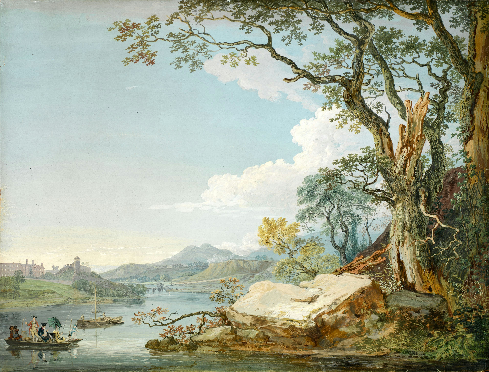

# Sway Auto Rice - Birmingham Theme

This repo contains my dotfiles for Sway, Waybar, Neovim color theme and Foot terminal. The theme is built around a watercolor river landscape (`.sway/birmingham-art-wallpaper.jpg`): a cool, near-black background with a full spread of colors pulled from the painting's sky, water and foliage.

The installation script is intended to be used with a fresh installation of Fedora Sway, but the dotfiles can be used without the script.



## Requirements
- Sway
- Waybar
- Foot
- Fedora (to install Neovim and Helium Browser with the script)

## What the script does
**Always check the contents of a script before running it***
`auto-rice.sh` does the following:
- Moves the dotfiles into the users home directory.
- Downloads and installs the JetBrains Mono Nerdfont.
- Installs Neovim
- Installs the browser that has been configured in `.sway/config` to be launched with a shortcut (`mod + w`)

## Installation with auto rice script

1. Clone the repo:
```bash
git clone https://github.com/tcvscheppingen/sway-dotfiles-birmingham.git
```
2. Make the autorice script executable:
```bash
cd sway-dotfiles-birmingham
sudo chmod +X auto-rice.sh
```
3. Run the installation script:
```bash
sh auto-rice.sh
```
4. Refresh Sway config (`mod + shift + c` by default)

## Manual installation

1. Clone the repo:
```bash
git clone https://github.com/tcvscheppingen/sway-dotfiles-birmingham.git
```

2. Create a folder for the JetBrains Mono Nerdfont:
```bash
mkdir -p ~/.local/share/fonts/JetBrainsMonoNerdFont
cd ~/.local/share/fonts/JetBrainsMonoNerdFont
```

3. Download and install the font:
```bash
curl -LO https://github.com/ryanoasis/nerd-fonts/releases/latest/download/JetBrainsMono.zip
unzip JetBrainsMono.zip
rm JetBrainsMono.zip
```

4. Refresh font cache:
```bash
fc-cache -fv
```

5. Move the dotfiles into the home folder:
```bash
mkdir -p ~/.sway
mkdir -p ~/.config
cd ~/sway-dotfiles-birmingham # Or wherever you cloned the repo
cp -a .sway/. ~/.sway/
cp -a .config/. ~/.config/
```

6. (Optional) Install Helium Browser or change the default browser
A shortcut has been configured to launch a web browser. The Sway config has been set to launch Helium Browser.
You can either download Helium Browser:
```bash
dnf copr enable imput/helium
dnf install helium-bin
```

Or you can change the browser in `~/.sway/config`
```lua
set $browser helium # Change default browser
```

## Palette

Every color in the Neovim colorscheme, Foot terminal, and Waybar bar is sampled or derived from `birmingham-art-wallpaper.jpg`, spread across enough distinct hues (blue, teal, green, lime, gold, orange, rust) to keep syntax highlighting easy to read at a glance, rather than leaning on a single muddy brown family.

| Role | Color |
|---|---|
| Background | `#14171A` |
| Foreground | `#E8E6DC` |
| Comment | `#93A79A` |
| Blue-gray | `#6C93A8` |
| Blue | `#5FA8D8` |
| Teal | `#4FB2B0` |
| Green | `#6FBF55` |
| Lime | `#B9CC5E` |
| Gold | `#F2B94E` |
| Orange | `#E8873D` |
| Red | `#EB5B36` |

## Credits

Wallpaper: 18th-century watercolor river landscape.
